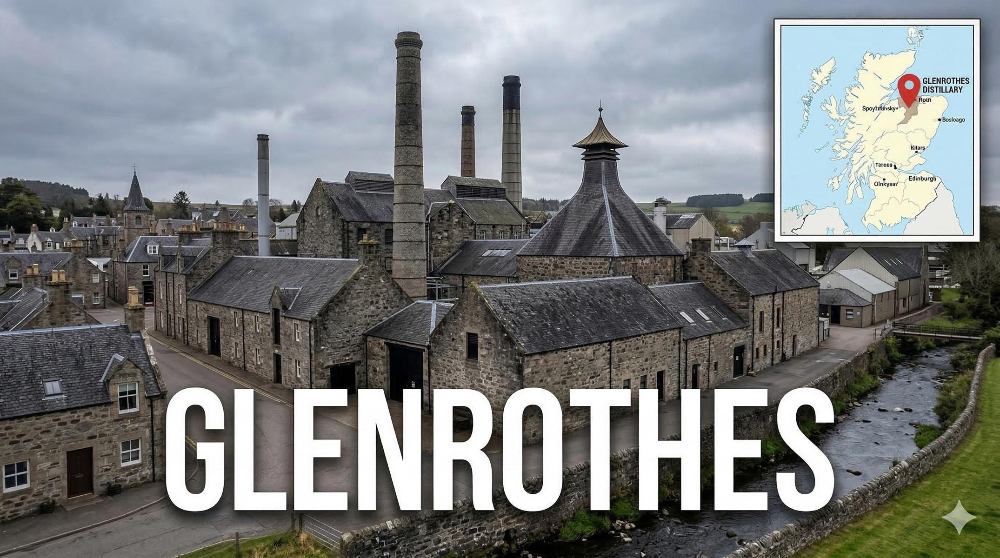
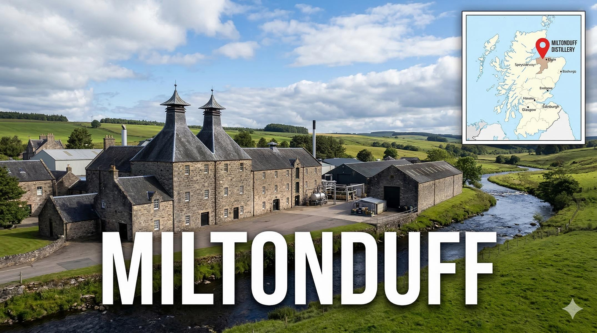
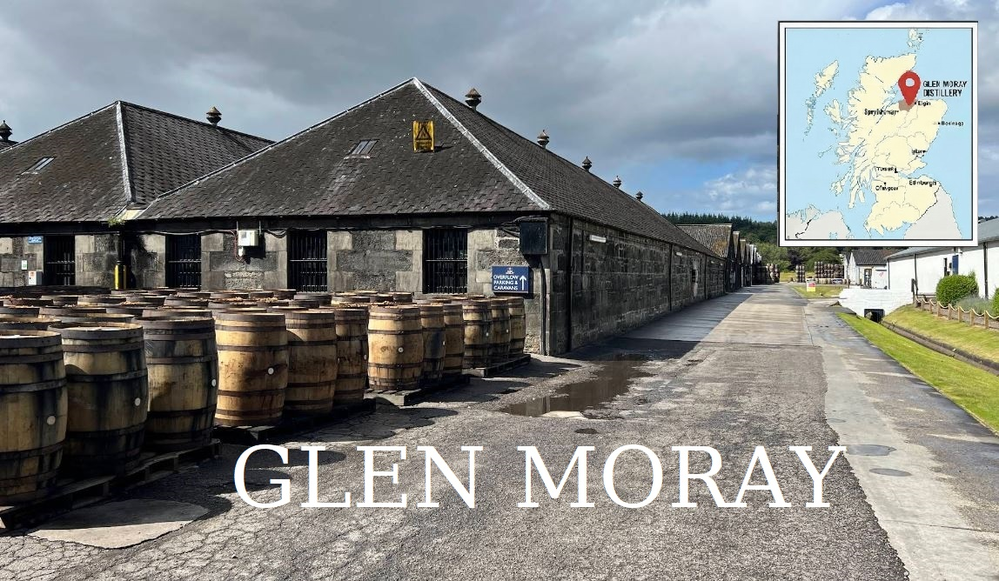
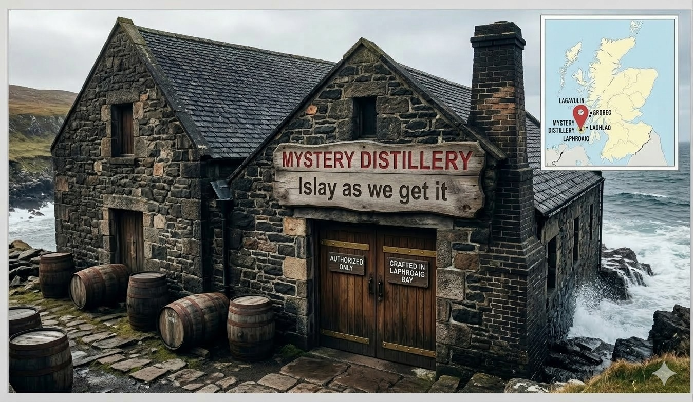

# Whiskytasting
## For Newbies

**16.03.2026**

---

# 1. Was ist Whisky eigentlich?

**„Uisge Beatha“** – Gälisch für das *„Wasser des Lebens“*.

- Eine Spirituose, die durch Destillation aus Getreidemaische gewonnen wird.
- **Die goldene Regel:** Er muss mindestens **3 Jahre** in Holzfässern (meist Eiche) reifen, um sich in Europa überhaupt „Whisky“ nennen zu dürfen.
- Ein Zusammenspiel aus Handwerk, Zeit und Natur.

---

# 2. Die „Heilige Dreifaltigkeit“
### Die drei Grundzutaten

Whisky ist ein Naturprodukt. Er besteht im Kern aus nur drei Komponenten:

1. **Wasser:** Oft die eigene Quelle der Destillerie; mineralarm oder torfhaltig.
2. **Getreide:** Meist gemälzte Gerste (für Single Malts), aber auch Mais, Roggen oder Weizen.
3. **Hefe:** Der Motor der Fermentation, der Zucker in Alkohol und wichtige Ester-Aromen verwandelt.

---

# 3. Der Weg zum Aroma
### Woher kommen die 100% Geschmack?

Obwohl die Zutaten simpel sind, ist das Ergebnis komplex:

* **Das Getreide:** Bringt Noten von Keks, Röstbrot oder Malz.
* **Die Destillation:** Formt den Körper (leicht & floral vs. schwer & ölig).
* **Das Fass (bis zu 70% des Geschmacks):** Die Eiche spendet Vanille, Karamell, Tannine und die charakteristische Farbe.

---

---

# Die Geburt des flüssigen Goldes

**Mälzen (Malting)**
   Gerste wird eingeweicht und zum Keimen gebracht, um Stärke in Zucker zu wandeln. Danach wird sie im *Kiln* getrocknet (evtl. mit Torfrauch).

---

# Die Geburt des flüssigen Goldes

**Gären (Fermentation)**
   Das geschrotete Malz wird mit heißem Wasser vermischt (*Mash Tun*). Die süße Flüssigkeit (**Wort**) kommt mit Hefe in die Gärbottiche (**Wash Backs**). Ergebnis: Ein bierähnlicher "Wash" mit ca. 8–9% Alkohol.

---

# Die Geburt des flüssigen Goldes

**Brennen (Distillation)**
   In kupfernen Brennblasen (**Pot Stills**) wird der Wash zweifach (selten dreifach) destilliert. Nur das Herzstück, der **New Make**, wandert später ins Fass.

---

# Die Reifung: Geduld in Eiche
### Wo der "Spirit" seine Seele findet

* **Das Fass ist die wichtigste Zutat:** Über **60 % bis 80 %** des endgültigen Aromas und 100 % der Farbe stammen aus dem Holz.

* **Die Magie der Vorbelegung:** - **Ex-Bourbon:** Verleiht Vanille, Honig und Karamellnoten.
  - **Ex-Sherry:** Bringt dunkle Früchte, Schokolade und Würze.

* **Interaktion mit der Natur:**
  Das Holz "atmet" – es entzieht dem Whisky Schärfe und gibt ihm Komplexität.

* **The Angel’s Share:** Jedes Jahr verdunsten ca. **2 %** des Inhalts. Ein kleiner Tribut an die Engel für einen besseren Whisky.

---

---

# Deanston Distillery

### Eckdaten
* **Eröffnungsjahr:** 1965 (Umbau einer Baumwollmühle von 1785)
* **Besitzer:** CVH Spirits (Burn Stewart Distillers)
* **Produktionskapazität:** ca. 3.000.000 Liter reiner Alkohol pro Jahr

### Charakter & Profil
* **Stil:** Weich, malzig, honigsüß und oft mit einer markanten Wachsnote.
* **Besonderheit:** Nutzt ausschließlich schottische Gerste; die Reifung erfolgt in den kühlen, feuchten Hallen der ehemaligen Weberei.
* **Typische Aromen:** Heidehonig, geröstete Nüsse, Gerste, Zitronenschale.

---

# Deanston 10-year-old Bordeaux Red Wine Cask Finish

### Details zur Abfüllung
* **Destilliert:** ?
* **Abgefüllt:** 2020
* **Abfüller:** Deanston (Distillery Bottling)
* **Alkoholstärke:** 46.3 % Vol.
* **Flaschenanzahl:** ?
* **Whiskybase-Rating:** 85.08 / 100 

 

###### Quelle: https://www.whiskybase.com/whiskies/whisky/195883/deanston-10-year-old

---

---

# Glenrothes Distillery
## Die Fakten

* **Eröffnungsjahr:** 1879
* **Besitzer:** Edrington Group
* **Produktion:** ca. 5,6 Mio. Liter pro Jahr
* **Geschmacksprofil:** Vielschichtig und elegant. Typisch sind Noten von reifen Früchten, Zitrus, Vanille und – durch die starke Verwendung von Sherryfässern – oft eine feine Würze (Zimt).
---

# Glenrothes 2011 SV

### Details zur Abfüllung
* **Destilliert:** 2011 (07.03.2011)
* **Abgefüllt:** 2022 (27.05.2022)
* **Abfüller:** Signatory Vintage (SV)
* **Alkoholstärke:** 46.0 % Vol.
* **Flaschenanzahl:** 12350
* **Whiskybase-Rating:** 82.11 / 100 

 

###### Quelle: https://www.whiskybase.com/whiskies/whisky/217267/glenrothes-2011-sv

---

---

# Miltonduff Distillery
## Die Fakten

* **Eröffnungsjahr:** 1824
* **Besitzer:** Chivas Brothers (Pernod Ricard)
* **Produktion:** ca. 5,9 Mio. Liter pro Jahr
* **Geschmacksprofil:** Floral, rein und ölig. Bekannt für Noten von Kräutern, Blütenhonig und einer sanften Nussigkeit. Ein Kernbestandteil der Ballantine’s Blends.
---

# Miltonduff 2009

### Details zur Abfüllung
* **Destilliert:** 2009 
* **Abgefüllt:** 2022 
* **Abfüller:** Morrison Scotch Whisky Distillers (MSWD)
* **Alkoholstärke:** 47.5 % Vol.
* **Flaschenanzahl:** 1355
* **Whiskybase-Rating:** 85.71 / 100 

 

###### Quelle: https://www.whiskybase.com/whiskies/whisky/214036/miltonduff-2009-mswd

---

---
# Glen Moray Distillery
## Die Fakten

* **Eröffnungsjahr:** 1897 (ehemals eine Brauerei)
* **Besitzer:** La Martiniquaise
* **Produktion:** ca. 6,0 Mio. Liter pro Jahr
* **Geschmacksprofil:** Leicht, süß und sehr zugänglich. Dominante Aromen von Butterscotch, frischen Äpfeln, Birnen und Vanille.

---

# Glen Moray 2007

### Details zur Abfüllung
* **Destilliert:** 2007 
* **Abgefüllt:** 2019 
* **Abfüller:** Die Whiskyquelle
* **Alkoholstärke:** 57.8 % Vol.
* **Flaschenanzahl:** ?
* **Whiskybase-Rating:** 84.33 / 100 

 

###### Quelle: https://www.whiskybase.com/whiskies/whisky/147237/glen-moray-2007-jw

---

---

# Benromach Distillery
## Die Fakten

* **Eröffnungsjahr:** 1898 (1998 durch Gordon & MacPhail wiedereröffnet)
* **Besitzer:** Gordon & MacPhail
* **Produktion:** ca. 700.000 Liter pro Jahr (kleine „Handcraft“-Destillerie)
* **Geschmacksprofil:** Der „klassische Speyside-Stil“ der Vergangenheit. Leicht torfig/rauchig, kombiniert mit reichhaltigen Fruchtnoten, Malz und Schokolade.
---

# Benromach 2012

### Details zur Abfüllung
* **Destilliert:** 2012 
* **Abgefüllt:** 2022 
* **Abfüller:** Benromach
* **Alkoholstärke:** 60.2 % Vol.
* **Flaschenanzahl:** ?
* **Whiskybase-Rating:** 87.39 / 100 

 

###### Quelle: https://www.whiskybase.com/whiskies/whisky/214604/benromach-2012

---

---

# Mystery Distillery

### Das Islay-Geschmacksprofil
* **Rauch & Torf:** Dominante Noten von Lagerfeuerasche, kaltem Rauch und trockenem Torf.
* **Maritimer Charakter:** Deutliche Anklänge von Meersalz, Algen und Gischt (Salzwasser).
* **Medizinische Noten:** Oft assoziiert mit Jod, Heftpflastern oder Teer – ein Markenzeichen vieler Südküsten-Brennereien.
* **Süße & Körper:** Hinter dem Rauch finden sich oft süße Vanille (aus Ex-Bourbon-Fässern) oder ölige, speckige Texturen.

> "Entweder man liebt ihn, oder man hasst ihn – ein Dazwischen gibt es bei echtem Islay-Rauch kaum."

---

# Mystery Distillery

### Details zur Abfüllung
* **Destilliert:** 2015 
* **Abgefüllt:** ? 
* **Abfüller:** Ian Macleod
* **Alkoholstärke:** 61.3 % Vol.
* **Flaschenanzahl:** ?
* **Whiskybase-Rating:** 85.34 / 100 

 

###### Quelle: https://www.whiskybase.com/whiskies/whisky/69695/as-we-get-it-nas-im

