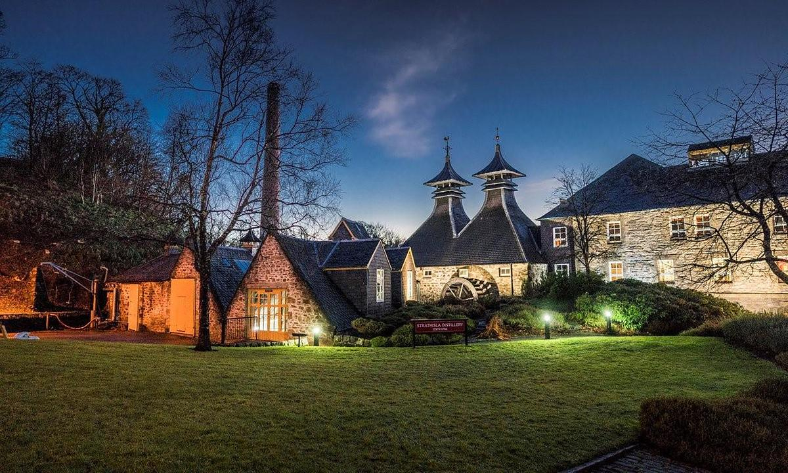

# Whiskytasting
## For Newbies

**16.03.2026**

---

# 1. Was ist Whisky eigentlich?

**„Uisge Beatha“** – Gälisch für das *„Wasser des Lebens“*.

- Eine Spirituose, die durch Destillation aus Getreidemaische gewonnen wird.
- **Die goldene Regel:** Er muss mindestens **3 Jahre** in Holzfässern (meist Eiche) reifen, um sich in Europa überhaupt „Whisky“ nennen zu dürfen.
- Ein Zusammenspiel aus Handwerk, Zeit und Natur.

---

# 2. Die „Heilige Dreifaltigkeit“
### Die drei Grundzutaten

Whisky ist ein Naturprodukt. Er besteht im Kern aus nur drei Komponenten:

1. **Wasser:** Oft die eigene Quelle der Destillerie; mineralarm oder torfhaltig.
2. **Getreide:** Meist gemälzte Gerste (für Single Malts), aber auch Mais, Roggen oder Weizen.
3. **Hefe:** Der Motor der Fermentation, der Zucker in Alkohol und wichtige Ester-Aromen verwandelt.

---

# 3. Der Weg zum Aroma
### Woher kommen die 100% Geschmack?

Obwohl die Zutaten simpel sind, ist das Ergebnis komplex:

* **Das Getreide:** Bringt Noten von Keks, Röstbrot oder Malz.
* **Die Destillation:** Formt den Körper (leicht & floral vs. schwer & ölig).
* **Das Fass (bis zu 70% des Geschmacks):** Die Eiche spendet Vanille, Karamell, Tannine und die charakteristische Farbe.

---

---

# Deanston

https://www.whiskybase.com/whiskies/whisky/195883/deanston-10-year-old

---

# Die Geburt des flüssigen Goldes

**Mälzen (Malting)**
   Gerste wird eingeweicht und zum Keimen gebracht, um Stärke in Zucker zu wandeln. Danach wird sie im *Kiln* getrocknet (evtl. mit Torfrauch).

---

# Die Geburt des flüssigen Goldes

**Gären (Fermentation)**
   Das geschrotete Malz wird mit heißem Wasser vermischt (*Mash Tun*). Die süße Flüssigkeit (**Wort**) kommt mit Hefe in die Gärbottiche (**Wash Backs**). Ergebnis: Ein bierähnlicher "Wash" mit ca. 8–9% Alkohol.

---

# Die Geburt des flüssigen Goldes

**Brennen (Distillation)**
   In kupfernen Brennblasen (**Pot Stills**) wird der Wash zweifach (selten dreifach) destilliert. Nur das Herzstück, der **New Make**, wandert später ins Fass.

---

# Die Reifung: Geduld in Eiche
### Wo der "Spirit" seine Seele findet

* **Das Fass ist die wichtigste Zutat:** Über **60 % bis 80 %** des endgültigen Aromas und 100 % der Farbe stammen aus dem Holz.

* **Die Magie der Vorbelegung:** - **Ex-Bourbon:** Verleiht Vanille, Honig und Karamellnoten.
  - **Ex-Sherry:** Bringt dunkle Früchte, Schokolade und Würze.

* **Interaktion mit der Natur:**
  Das Holz "atmet" – es entzieht dem Whisky Schärfe und gibt ihm Komplexität.

* **The Angel’s Share:** Jedes Jahr verdunsten ca. **2 %** des Inhalts. Ein kleiner Tribut an die Engel für einen besseren Whisky.

---

# Glenrothes

https://www.whiskybase.com/whiskies/whisky/217267/glenrothes-2011-sv

---

# Miltonduff

https://www.whiskybase.com/whiskies/whisky/214036/miltonduff-2009-mswd

---

# Glen Moray

https://www.whiskybase.com/whiskies/whisky/147237/glen-moray-2007-jw

---

# Benromach

https://www.whiskybase.com/whiskies/whisky/214604/benromach-2012

---

# ??? (Islay as we get it)

https://www.whiskybase.com/whiskies/whisky/69695/as-we-get-it-nas-im
---

